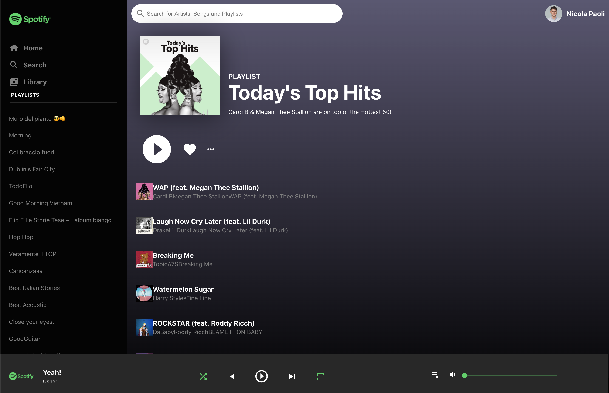

## Spotify React Clone App

A Spotify Front End Clone made with React

### App Screenshot

This is the result, playlists and songs are loaded using Spotify APIs after user login.



### Setup

You need to create a Spotify Developer APP and Save your Client ID in the Env VAR `CLIENTID` before launching the app.

```
export CLIENTID = <YOUR-SPOTIFY-CLIENT-ID>
npm start
```


#### Acknowledgments
Thanks to Clever Programmer. This repo was made following their  [youtube videos](https://www.youtube.com/watch?v=pnkuI8KXW_8).